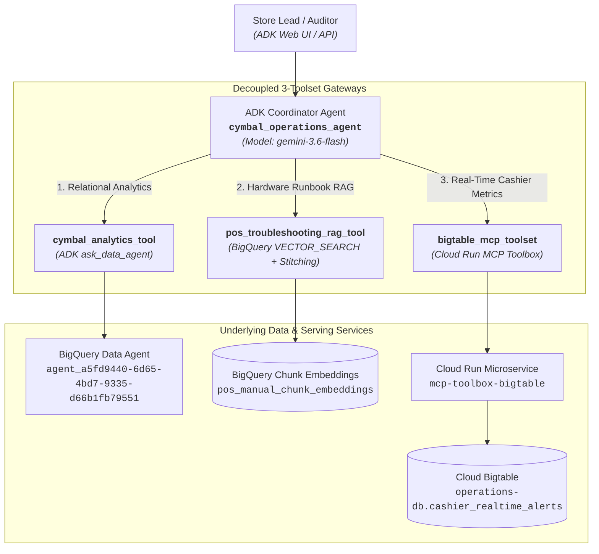

# Implementation Plan: Module 3 Lab 3 - Multi-Tool ADK Coordinator Agent

---

## 🎯 Executive Overview & Scope

- **Goal**: Build, package, deploy, and validate the decoupled 3-toolset ADK Coordinator Agent (**`cymbal_operations_agent`**) using **`gemini-3.6-flash`** (or `gemini-2.5-flash`) to automate store operations, hardware troubleshooting, real-time cashier risk audits, and cross-cloud forensic analytics.
- **Assigned GCP Project**: `data-adv-sg`
- **Region**: `us-central1`
- **Published BQ Data Agent**: `projects/data-adv-sg/locations/global/dataAgents/agent_a5fd9440-6d65-4bd7-9335-d66b1fb79551`
- **Bigtable Instance & Table**: `operations-db` / `cashier_realtime_alerts`
- **Codebase Location**: `labs/dev/cymbal_operations_agent/` (Isolated `uv` environment adhering to system repository standards)

---

## 🏗️ Architecture: Decoupled 3-Toolset Topology



---

## 📋 Detailed Implementation Steps

### Phase 1: Project Scaffolding & Isolated Environment (Challenge 1.1)
1. Initialize agent project directory at `labs/dev/cymbal_operations_agent/`.
2. Scaffold structure using `agents-cli scaffold create --adk cymbal_operations_agent -o labs/dev/ --auto-approve` or custom modular layout:
   ```text
   labs/dev/cymbal_operations_agent/
   ├── .env
   ├── requirements.txt
   ├── pyproject.toml
   ├── app/
   │   ├── __init__.py
   │   ├── agent.py               # Coordinator agent definition & system instructions
   │   └── tools/
   │       ├── __init__.py
   │       ├── analytics_tool.py  # cymbal_analytics_tool (BQCA wrapper)
   │       ├── rag_tool.py        # pos_troubleshooting_rag_tool (BigQuery Vector Search)
   │       └── bigtable_tool.py   # bigtable_mcp_toolset (Cloud Run MCP integration)
   └── mcp/
       └── tools.yaml             # Bigtable MCP toolbox configuration
   ```
3. Initialize isolated Python virtual environment using `uv venv` and install dependencies:
   - `google-adk==2.3.0`
   - `mcp==1.29.0`
   - `google-genai`
   - `google-cloud-bigquery`
   - `google-cloud-bigtable`
   - `google-cloud-secret-manager`
4. Configure `.env` with:
   - `PROJECT_ID=data-adv-sg`
   - `LOCATION=us-central1`
   - `DATA_AGENT_ID=projects/data-adv-sg/locations/global/dataAgents/agent_a5fd9440-6d65-4bd7-9335-d66b1fb79551`
   - `BIGTABLE_INSTANCE=operations-db`
   - `BIGTABLE_TABLE=cashier_realtime_alerts`

---

### Phase 2: Tool Implementation & Microservice Deployment (Part 2)

#### Challenge 2.1: NL2SQL Data Agent Tool (`cymbal_analytics_tool`)
- Implement `cymbal_analytics_tool` in `app/tools/analytics_tool.py`:
  - Target published Data Agent resource name: `projects/data-adv-sg/locations/global/dataAgents/agent_a5fd9440-6d65-4bd7-9335-d66b1fb79551`.
  - Wrap ADK's `ask_data_agent` in a custom `FunctionTool`.
  - Include 3 exponential backoff retries with jitter for transient database failures.
  - Implement fallback handling returning a user-friendly diagnostic message if connectivity drops.
  - Ensure natural language terms (*Net Transaction Revenue*, *Total On-Hand Inventory*, *Estimated Cover Hours*, *Cashier Promo Override Rate*) are passed verbatim.

#### Challenge 2.2: POS RAG Tool & Adjacent Context Window Stitching (`pos_troubleshooting_rag_tool`)
- **Step 1: Sliding Window Chunking (GoogleSQL)**:
  - Query `data-adv-sg.module1_unstructureddata.pos_manual_generic_sections_extracted`.
  - Create table `data-adv-sg.cymbal_gold.pos_manual_chunk_embeddings` using sliding window (500 chars, 100 char overlap / 400 step size):
    - `GENERATE_ARRAY(1, GREATEST(LENGTH(extracted_full_content), 1), 400)` with `OFFSET chunk_index`.
    - `SUBSTR(extracted_full_content, offset_pos, 500)`.
    - Filter `LENGTH(TRIM(chunk_text)) > 30`.
- **Step 2: Dense Vector Embeddings (BigQuery ML)**:
  - Generate embeddings using `ML.GENERATE_EMBEDDING` with Vertex AI model `text-embedding-005` or create model in BigQuery if needed.
  - Prepend title: `CONCAT('[', document_title, ']\n', chunk_content)`.
- **Step 3: Vector Search with Adjacent Context Stitching**:
  - Run `VECTOR_SEARCH` with `COSINE` distance.
  - Join matched chunk $m$ to adjacent chunks $c$ on `c.chunk_index BETWEEN (m.chunk_index - 1) AND (m.chunk_index + 1)`.
  - Aggregate with `STRING_AGG(c.chunk_content, '\n' ORDER BY c.chunk_index ASC)`.
- **Step 4: Tool Hardening**:
  - Implement in `app/tools/rag_tool.py` with `0.70` similarity score threshold (`1 - distance`).
  - Fallback to `SEARCH(chunk_content, @query)` when similarity $< 0.70$.
  - Convert `gs://` to `https://storage.cloud.google.com/`.

#### Challenge 2.3: Cloud Bigtable MCP Microservice & Toolset (`bigtable_mcp_toolset`)
- **Step 1: Author MCP Configuration (`tools.yaml`)**:
  - Define Bigtable data source targeting `operations-db`, table `cashier_realtime_alerts`, project `data-adv-sg`.
- **Step 2: Store in Secret Manager**:
  - Create secret `bigtable-mcp-tools-secret` and upload `tools.yaml`.
- **Step 3: Deploy Cloud Run MCP Microservice**:
  - Deploy `mcp-toolbox-bigtable` using container image `us-central1-docker.pkg.dev/database-toolbox/toolbox/toolbox:latest`.
  - Mount secret `bigtable-mcp-tools-secret` at `/etc/toolbox/tools.yaml`.
- **Step 4: Implement `bigtable_mcp_toolset`**:
  - Initialize ADK's `McpToolset` pointing to the deployed Cloud Run service URL.
  - Configure GCP OIDC ID token bearer authentication for service-to-service calls.

---

### Phase 3: Coordinator Binding & System Prompts (Challenge 3.1)
- In `app/agent.py`, configure root coordinator `cymbal_operations_agent`:
  - **Model**: `gemini-3.6-flash` (or Vertex AI equivalent).
  - **Toolsets**: Bind `cymbal_analytics_tool`, `pos_troubleshooting_rag_tool`, and `bigtable_mcp_toolset`.
  - **Routing Instructions**:
    1. **Single-Tool Dispatch**: For direct operational questions (e.g., hardware fault -> RAG tool; stockout risk -> analytics tool; live cashier audit -> Bigtable tool).
    2. **Parallel Tool Dispatch**: Concurrently query Bigtable MCP (live 1-hour metrics) and BigQuery analytics (7-day baseline) in a single turn for comparative risk evaluation.
    3. **Sequential Multi-Turn Dispatch**: Perform cross-cloud forensic audits in 2 steps (Step 1: rank top promo abuse cashiers in GCP; Step 2: retrieve checkout logs for the identified cashier from AWS S3 BigLake).

---

### Phase 4: Local Testing & Validation (Challenge 4.1)
- Run empirical tests against all 7 required operational scenarios:
  1. **UC 1.1a Hardware Error**: `ERR-PAY-4001` contactless payment freeze -> Returns Toshiba TCx 810 PDF link.
  2. **UC 1.1c Out-of-Scope Hardware**: Ford F-150 oil change -> Returns certified uncertified warning string.
  3. **UC 1.2a Stockout Risk (<20h)**: Inventory cover hours < 20.0 and total on-hand units.
  4. **UC 1.3 Real-Time Cashier Metrics**: Live 1-hour rolling metrics for `CASH_1190` at `STORE_048`.
  5. **UC 2.1a Warranty Transaction**: `TXN-20260312-0015811` warranty policy details.
  6. **UC 2.2 Dual Cashier Baseline**: Live 1-hour override rate vs 7-day historical baseline (Parallel Dispatch).
  7. **UC 2.3 Cross-Cloud Offender Audit**: Top promo abuse offender ranking -> AWS S3 checkout logs (Sequential Dispatch).
- Verify ADK execution waterfall traces.
- Run Agent Codebase Readiness check on Feedback server.

---

## 🚦 Acceptance & Verification Criteria

| Check | Requirement | Verification Target |
|---|---|---|
| 1 | Agent Scaffolding | Isolated `uv` environment in `labs/dev/cymbal_operations_agent/` |
| 2 | NL2SQL Data Agent Tool | Calls `agent_a5fd9440-6d65-4bd7-9335-d66b1fb79551` with retries |
| 3 | POS Troubleshooting RAG | 500-char sliding window, BigQuery vector search, adjacent chunk stitching, 0.70 threshold |
| 4 | Bigtable MCP Microservice | Cloud Run deployed, `operations-db` connected, OIDC authenticated |
| 5 | Coordinator Intent Routing | Single, parallel, and sequential multi-turn dispatch supported |
| 6 | 7 Operational Scenarios | All scenarios pass validation with empirical data returned |
